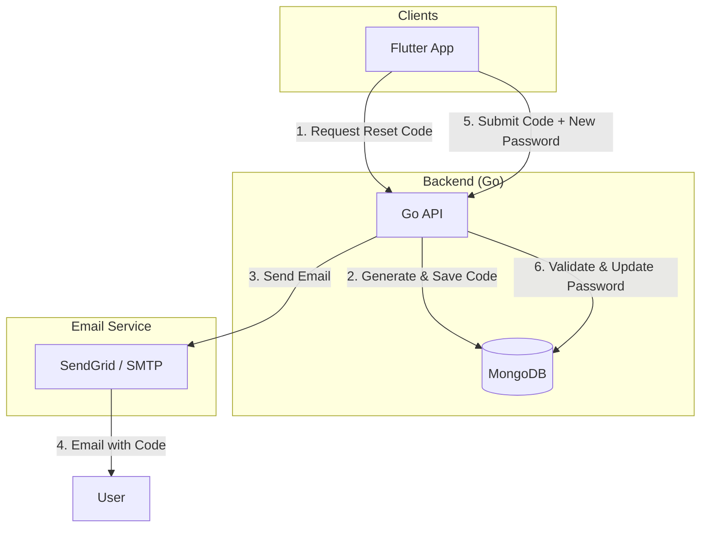

# Forgot Password System Setup Guide

This guide describes how to set up and use the password reset system for the RIYO streaming app.

## Architecture Overview

## 1. SendGrid Setup (Free Subdomain)

1. Sign up for a [SendGrid](https://sendgrid.com/) account.
2. Go to **Settings > API Keys** and create a new API Key with "Mail Send" permissions.
3. (Optional) For subdomain sending, SendGrid typically requires domain authentication, but you can use their "noreply@sendgrid.net" or similar if you don't have a domain, or use the Single Sender Verification.
4. Add the API Key to your backend environment variables.

## 2. Backend Configuration

Set the following environment variables in your backend:

- `SENDGRID_API_KEY`: Your SendGrid API Key.
- `EMAIL_FROM`: The sender email address (e.g., `noreply@riyobox.sendgrid.net`).
- `SMTP_HOST`: (Optional fallback) SMTP server host.
- `SMTP_PORT`: (Optional fallback) SMTP server port.
- `SMTP_USER`: (Optional fallback) SMTP username.
- `SMTP_PASS`: (Optional fallback) SMTP password.

## 3. Database Schema

Reset codes are stored in the `password_resets` collection with the following fields:
- `email`: User's email.
- `code`: 6-digit numeric code.
- `expiresAt`: Expiration timestamp (15 minutes).
- `isUsed`: Boolean flag.
- `createdAt`: Generation timestamp.

## 4. Security Features

- **Rate Limiting**: Limits reset requests to 5 per hour per email.
- **Expiration**: Codes are valid for only 15 minutes.
- **One-Time Use**: Codes are marked as used after a successful reset.
- **Password Hashing**: New passwords are hashed using `bcrypt` before storage.
- **Min Length**: New passwords must be at least 6 characters long.
