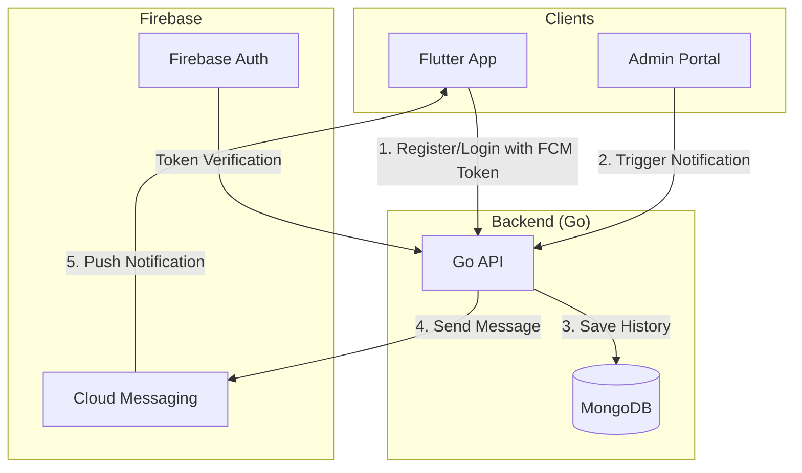

# Push Notification System Setup Guide

This guide describes how to set up and use the push notification system for the RIYO streaming app.

## Architecture Overview

## 1. Firebase Setup

### Step 1: Create Firebase Project
1. Go to the [Firebase Console](https://console.firebase.google.com/).
2. Create a new project or select an existing one.

### Step 2: Configure Android/iOS
1. Register your Flutter app's package name (e.g., `com.riyobox.app`).
2. Download `google-services.json` (Android) and `GoogleService-Info.plist` (iOS).
3. Place `google-services.json` in `android/app/`.

### Step 3: Enable Cloud Messaging
1. In the Firebase Console, go to **Project Settings > Cloud Messaging**.
2. Ensure **Firebase Cloud Messaging API (V1)** is enabled.

### Step 4: Create Service Account
1. Go to **Project Settings > Service Accounts**.
2. Click **Generate new private key**.
3. Save the JSON file as `backend/firebase-credentials.json`.
4. Ensure the environment variable `FIREBASE_CREDENTIALS_FILE` points to this file.

## 2. Backend Configuration

The Go backend uses the Firebase Admin SDK to send notifications.

- **Tokens**: Stored in the `User` model under the `fcmTokens` field (array of strings).
- **History**: Logged in the `notifications` collection.
- **Endpoints**:
  - `POST /admin/notifications`: Sends notifications to "all" or "specific" users.
  - `GET /admin/notifications/history`: Retrieves notification logs.

## 3. Flutter Integration

The Flutter app handles:
- **Token Registration**: Sent to backend during login/signup.
- **Background Handling**: Handled via `_firebaseMessagingBackgroundHandler`.
- **Interaction**: Users tapping notifications can be routed to specific screens (implemented in `NotificationService._handleMessage`).

## 4. Usage

### Automatic Welcome Notification
Every new user who registers will automatically receive a "Welcome to RIYO" notification once their FCM token is registered with the backend.

### Admin Notifications
1. Log in to the Admin Portal.
2. Navigate to **Notification Management**.
3. Choose the target audience (All or Specific).
4. Enter Title and Message.
5. Click **Send Notification Now**.

## 5. Security & Best Practices
- **Admin Only**: Notification endpoints are protected by `AdminOnly` middleware.
- **Token Management**: Tokens are added to a set (`$addToSet`) to prevent duplicates.
- **Async Sending**: Notifications are sent via Go routines in some cases to prevent blocking the main request thread.
